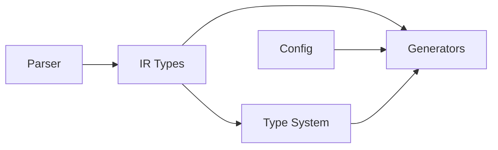

# API Reference

API documentation for Polyglot FFI's public interfaces.

## Overview

Polyglot FFI provides a modular API organized into five main components:



## Core Modules

### [Parser](parser.md)
Parse source language files into intermediate representation.

**Key Classes:**
- `OCamlParser` - Parse OCaml .mli files
- `parse_mli_file()` - Convenience function for file parsing
- `parse_mli_string()` - Parse OCaml code from strings

**Use When:**
- Reading OCaml interface files
- Converting source code to IR
- Building custom parsers

**Example:**
```python
from polyglot_ffi.parsers.ocaml import parse_mli_file

module = parse_mli_file(Path("crypto.mli"))
print(f"Found {len(module.functions)} functions")
```

---

### [IR Types](ir-types.md)
Language-agnostic intermediate representation of types and functions.

**Key Classes:**
- `IRType` - Represents a type
- `IRFunction` - Represents a function
- `IRModule` - Represents a module
- `TypeKind` - Enumeration of type categories

**Use When:**
- Building parsers or generators
- Manipulating type representations
- Creating custom IR transformations

**Example:**
```python
from polyglot_ffi.ir.types import IRFunction, IRParameter, STRING

func = IRFunction(
    name="encrypt",
    parameters=[IRParameter(name="data", type=STRING)],
    return_type=STRING
)
```

---

### [Type System](type-system.md)
Manage type mappings between languages.

**Key Classes:**
- `TypeRegistry` - Central type mapping registry
- `get_default_registry()` - Get global registry instance

**Use When:**
- Mapping IR types to target languages
- Registering custom type mappings
- Validating type support

**Example:**
```python
from polyglot_ffi.type_system.registry import get_default_registry
from polyglot_ffi.ir.types import STRING

registry = get_default_registry()
python_type = registry.get_mapping(STRING, "python")  # "str"
```

---

### [Generators](generators.md)
Generate target language code from IR.

**Key Classes:**
- `CtypesGenerator` - Generate OCaml ctypes bindings
- `CStubGenerator` - Generate C wrapper code
- `PythonGenerator` - Generate Python wrappers
- `DuneGenerator` - Generate Dune build configs

**Use When:**
- Generating bindings for target languages
- Creating custom generators
- Producing build configurations

**Example:**
```python
from polyglot_ffi.generators.python_gen import PythonGenerator

gen = PythonGenerator()
code = gen.generate(module, "crypto")
Path("crypto_py.py").write_text(code)
```

---

### [Configuration](config.md)
Load and validate project configuration.

**Key Classes:**
- `ProjectConfig` - Complete project configuration
- `BindingsConfig` - Bindings-specific settings
- `TargetConfig` - Per-target-language configuration
- `load_config()` - Load from polyglot.toml
- `validate_config()` - Validate configuration

**Use When:**
- Loading project settings
- Validating configuration files
- Creating default configurations

**Example:**
```python
from polyglot_ffi.core.config import load_config

config = load_config()
print(f"Project: {config.name}")
for target in config.targets:
    if target.enabled:
        print(f"  Target: {target.language}")
```

---

## Quick Start

### Basic Workflow

```python
from pathlib import Path
from polyglot_ffi.parsers.ocaml import parse_mli_file
from polyglot_ffi.generators.python_gen import PythonGenerator

# 1. Parse OCaml interface
module = parse_mli_file(Path("crypto.mli"))

# 2. Generate Python bindings
generator = PythonGenerator()
python_code = generator.generate(module, "crypto")

# 3. Save output
Path("crypto_py.py").write_text(python_code)
```

### Complete Generation

```python
from pathlib import Path
from polyglot_ffi.parsers.ocaml import parse_mli_file
from polyglot_ffi.generators.ctypes_gen import CtypesGenerator
from polyglot_ffi.generators.c_stubs_gen import CStubGenerator
from polyglot_ffi.generators.python_gen import PythonGenerator
from polyglot_ffi.generators.dune_gen import DuneGenerator

# Parse
module = parse_mli_file(Path("crypto.mli"))

# Generate all artifacts
output = Path("generated")
output.mkdir(exist_ok=True)

# OCaml ctypes
ctypes = CtypesGenerator()
(output / "type_description.ml").write_text(
    ctypes.generate_type_description(module)
)
(output / "function_description.ml").write_text(
    ctypes.generate_function_description(module)
)

# C stubs
c_gen = CStubGenerator()
(output / "stubs.c").write_text(c_gen.generate_stubs(module, "crypto"))
(output / "stubs.h").write_text(c_gen.generate_header(module, "crypto"))

# Python wrapper
py_gen = PythonGenerator()
(output / "crypto_py.py").write_text(py_gen.generate(module, "crypto"))

# Dune build
dune = DuneGenerator()
(output / "dune").write_text(dune.generate_dune("crypto"))
(output / "dune-project").write_text(dune.generate_dune_project("crypto"))
```

### Using Configuration

```python
from pathlib import Path
from polyglot_ffi.core.config import load_config
from polyglot_ffi.parsers.ocaml import parse_mli_file
from polyglot_ffi.generators.python_gen import PythonGenerator

# Load project configuration
config = load_config()

# Process each source file
for source_file in config.bindings.source_files:
    module = parse_mli_file(Path(source_file))

    # Generate for each enabled target
    for target in config.targets:
        if target.enabled and target.language == "python":
            gen = PythonGenerator()
            code = gen.generate(module, config.name)

            # Write to target output directory
            output_path = Path(target.output_dir) / f"{config.name}_py.py"
            output_path.parent.mkdir(parents=True, exist_ok=True)
            output_path.write_text(code)
```

## API Design Principles

### 1. Language-Agnostic IR

Parsers and generators are completely decoupled through the IR layer:

- **Parsers** only need to understand: Source Language → IR
- **Generators** only need to understand: IR → Target Language
- Adding new languages requires implementing only one side

### 2. Type Safety

All components use Python type hints for better IDE support and error catching:

```python
def parse_file(cls, path: Path) -> IRModule:
    """Parse returns a typed IRModule."""

def generate(self, module: IRModule, name: str) -> str:
    """Generate requires a typed IRModule input."""
```

### 3. Composability

Components can be used independently or composed:

```python
# Use parser alone
module = parse_mli_file(Path("api.mli"))

# Use generator alone (with manually created IR)
gen = PythonGenerator()
code = gen.generate(my_custom_module, "api")

# Compose them
module = parse_mli_file(Path("api.mli"))
code = PythonGenerator().generate(module, "api")
```

### 4. Error Handling

All components provide rich error messages:

```python
from polyglot_ffi.utils.errors import (
    ParseError,
    GenerationError,
    ConfigurationError,
    TypeMappingError
)

try:
    module = parse_mli_file(Path("api.mli"))
except ParseError as e:
    print(f"Line {e.context.line}: {e.message}")
    if e.suggestions:
        print(f"Try: {', '.join(e.suggestions)}")
```

### 5. Performance

All components are optimized for speed:

- Regex pre-compilation in parsers
- Type mapping caching in registry
- Efficient string building in generators
- Lazy initialization where appropriate

## Common Patterns

### Creating a Custom Generator

```python
from polyglot_ffi.ir.types import IRModule, IRFunction
from polyglot_ffi.type_system.registry import get_default_registry

class GoGenerator:
    """Generate Go FFI bindings."""

    def generate(self, module: IRModule, package: str) -> str:
        registry = get_default_registry()
        lines = [
            f"package {package}",
            "",
            "// #cgo LDFLAGS: -l{package}",
            "// #include <stdlib.h>",
            '// #include "stubs.h"',
            "import \"C\"",
            "",
        ]

        for func in module.functions:
            # Generate Go function wrapper
            go_params = []
            for param in func.parameters:
                go_type = self._map_type(param.type, registry)
                go_params.append(f"{param.name} {go_type}")

            go_return = self._map_type(func.return_type, registry)
            params_str = ", ".join(go_params)

            lines.append(f"func {func.name.title()}({params_str}) {go_return} {{")
            lines.append(f"\t// Call C function")
            lines.append(f"\treturn C.ml_{func.name}(...)")
            lines.append("}")
            lines.append("")

        return "\n".join(lines)
```

### Type Mapping with Custom Types

```python
from polyglot_ffi.type_system.registry import TypeRegistry
from polyglot_ffi.ir.types import ir_primitive

# Create custom registry
registry = TypeRegistry()

# Register custom types
registry.register_primitive("uuid", {
    "python": "uuid.UUID",
    "rust": "Uuid",
    "go": "string",
    "c": "char*"
})

registry.register_primitive("datetime", {
    "python": "datetime.datetime",
    "rust": "DateTime<Utc>",
    "go": "time.Time",
    "c": "time_t"
})

# Use custom types
uuid_type = ir_primitive("uuid")
python_type = registry.get_mapping(uuid_type, "python")  # "uuid.UUID"
```

## Next Steps

- **New to the API?** Start with [Parser](parser.md) to understand the input
- **Building a generator?** Read [Generators](generators.md) and [Type System](type-system.md)
- **Extending types?** Check [IR Types](ir-types.md) and [Type System](type-system.md)
- **Using in applications?** See [Configuration](config.md) for project setup

## See Also

- [Architecture](../architecture.md) - System design overview
- [Type Mapping](../type-mapping.md) - Type system details
- [Contributing](../contributing.md) - Development guidelines
