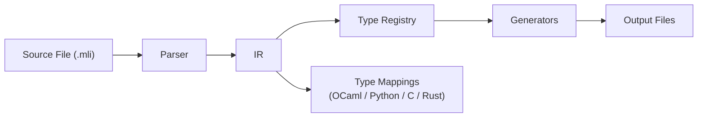

# Architecture

## Overview

Polyglot FFI uses a multi-stage pipeline to generate FFI bindings:



## Design Principles

1. **Language-Agnostic IR** - Intermediate representation decouples source and target languages
2. **Pluggable Generators** - Easy to add new target languages
3. **Type-Safe** - Preserves type information throughout pipeline
4. **Memory-Safe** - Proper CAMLparam/CAMLreturn, no leaks
5. **Testable** - Each component independently unit tested
6. **Extensible Type System** - Type Registry allows custom type mappings

## Components

### 1. Parser (`src/polyglot_ffi/parsers/ocaml.py`)

**Purpose:** Parse OCaml `.mli` files into AST

**Features:**
- Regex-based parsing
- Multi-line signature support (partial)
- Documentation comment extraction
- Error messages with line numbers

**Example:**
```python
from polyglot_ffi.parsers.ocaml import parse_mli_file

module = parse_mli_file("crypto.mli")
# Returns IRModule with functions
```

### 2. Intermediate Representation (`src/polyglot_ffi/ir/types.py`)

**Purpose:** Language-agnostic type system

**Key Types:**
- `IRModule` - Top-level module
- `IRFunction` - Function with params and return type
- `IRParameter` - Function parameter
- `IRType` - Type representation (primitive, option, list, tuple, record, variant)
- `IRTypeDefinition` - Custom type definitions (records, variants)
- `TypeKind` - Enum of type categories

**Enhancements:**
- Added `OPTION`, `LIST`, `TUPLE` type kinds
- Added `RECORD` and `VARIANT` type kinds
- Support for nested and combined types
- Type variables for polymorphic functions

**Example:**
```python
from polyglot_ffi.ir.types import (
    IRFunction, IRParameter, STRING, INT,
    ir_option, ir_list, ir_tuple
)

# Simple function
func = IRFunction(
    name="add",
    params=[IRParameter("x", INT), IRParameter("y", INT)],
    return_type=INT
)

# Function with complex types
find_func = IRFunction(
    name="find_user",
    params=[IRParameter("name", STRING)],
    return_type=ir_option(STRING)  # Returns string option
)
```

### 3. Type Registry (`src/polyglot_ffi/type_system/`) 

**Purpose:** Manage type mappings between languages

The Type Registry provides centralized, extensible type mapping management.

**Key Components:**

#### A. TypeRegistry (`registry.py`)
- Registers primitive type mappings
- Handles complex type conversions
- Supports custom type converters
- Validates type mappings

**Example:**
```python
from polyglot_ffi.type_system import TypeRegistry

registry = TypeRegistry()

# Register a primitive type
registry.register_primitive("string", {
    "ocaml": "string",
    "python": "str",
    "c": "char*",
    "rust": "String"
})

# Get mapping for target language
python_type = registry.get_mapping(ir_type, "python")
```

#### B. Built-in Types (`builtin.py`)
Pre-registered mappings for all standard types:
- Primitives: string, int, float, bool, unit
- Complex: option, list, tuple types
- Multi-language support: OCaml, Python, C, Rust

**Features:**
- Automatic handling of `Optional[T]`, `List[T]`, `Tuple[T1, T2]`
- Consistent naming conventions across languages
- Extensible via custom converters

**Example:**
```python
from polyglot_ffi.type_system import get_default_registry
from polyglot_ffi.ir.types import ir_option, STRING

registry = get_default_registry()

# Automatic complex type mapping
option_str = ir_option(STRING)
python_type = registry.get_mapping(option_str, "python")
# Returns: "Optional[str]"
```

### 4. Generators (`src/polyglot_ffi/generators/`)

#### A. Ctypes Generator (`ctypes_gen.py`)

Generates OCaml ctypes bindings:
- `type_description.ml` - Type definitions module
- `function_description.ml` - Foreign function declarations

#### B. C Stub Generator (`c_stubs_gen.py`)

Generates C wrapper code:
- Proper CAMLparam/CAMLlocal/CAMLreturn macros
- Type conversions (OCaml ↔ C)
- Memory management (strdup for strings)
- Multi-parameter callback support

#### C. Python Generator (`python_gen.py`)

Generates Python wrapper:
- Type hints
- Error handling with custom exceptions
- UTF-8 encoding/decoding
- Pythonic API

#### D. Dune Generator (`dune_gen.py`)

Generates build configuration:
- `dune` - Library and rule definitions
- `dune-project` - Project metadata

### 5. Commands (`src/polyglot_ffi/commands/`)

- `init.py` - Project scaffolding
- `generate.py` - Binding generation orchestration

### 6. CLI (`src/polyglot_ffi/cli/main.py`)

Click-based command-line interface with rich output.

## Data Flow

### Generation Pipeline

1. **Parse** `.mli` file → AST
2. **Convert** AST → IR (IRModule)
3. **Validate** IR types
4. **Generate** target code from IR
5. **Write** files to output directory

### Type Mapping

```
OCaml Type    →  IR Type       →  C Type    →  Python Type
-----------      ----------       --------      ------------
string        →  STRING        →  char*     →  str
int           →  INT           →  int       →  int
float         →  FLOAT         →  double    →  float
bool          →  BOOL          →  int       →  bool
unit          →  UNIT          →  void      →  None
```

## Generated Code Structure

For `crypto.mli`:

```
generated/
├── type_description.ml       # OCaml: module Types (F : TYPE) = ...
├── function_description.ml   # OCaml: module Functions (F : FOREIGN) = ...
├── crypto_stubs.c            # C: ml_encrypt, ml_decrypt, ml_hash
├── crypto_stubs.h            # C: function declarations
├── dune                      # Dune: library + rule
├── dune-project              # Dune: project metadata
└── crypto_py.py              # Python: encrypt(), decrypt(), hash()
```

## Memory Safety

### OCaml Side
- Functions registered with `Callback.register`
- GC-managed memory

### C Side
- `CAMLparam0()` - Declare no parameters
- `CAMLlocal2(ml_x, ml_y)` - Declare local GC roots
- `caml_copy_string()` - Copy C string to OCaml
- `String_val()` - Get C string from OCaml
- `strdup()` - Duplicate string for C ownership
- `CAMLreturnT(type, value)` - Return with GC awareness

### Python Side
- `encode('utf-8')` - Convert Python str to bytes
- `decode('utf-8')` - Convert bytes to Python str
- Error handling prevents NULL pointer dereferences

## Extensibility

### Adding a New Target Language

1. Create `src/polyglot_ffi/generators/rust_gen.py`
2. Implement generator class with `generate()` method
3. Map IR types to Rust types
4. Register in `__init__.py`
5. Add tests

### Adding a New Source Language

1. Create `src/polyglot_ffi/parsers/rust.py`
2. Implement parser class with `parse()` method
3. Convert to IR
4. Add tests

## Testing Strategy

- **Unit tests** - Test each component independently
- **Integration tests** - Test end-to-end generation
- **Fixtures** - Example `.mli` files for testing
- **Coverage** - 70%+ target (currently 61%)

## Performance

- **Parsing**: < 10ms for typical files
- **Generation**: < 100ms total
- **Zero runtime overhead**: All code generated at build time
