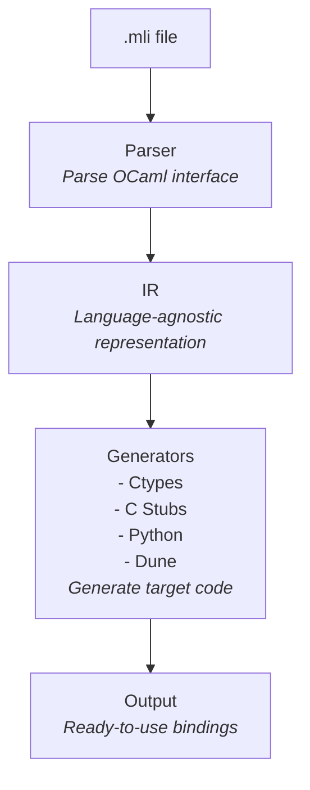

# Polyglot FFI Documentation

Welcome to Polyglot FFI! This tool automatically generates FFI (Foreign Function Interface) bindings between programming languages, eliminating the tedious boilerplate of manual ctypes, C stubs, and wrapper code.

## What is Polyglot FFI?

Polyglot FFI is a code generator that bridges programming languages by:

1. **Parsing** source language interface files (e.g., OCaml `.mli`)
2. **Analyzing** function signatures and types
3. **Generating** complete FFI bindings automatically:
   - OCaml ctypes declarations
   - Memory-safe C wrapper code
   - Type-safe target language wrappers (Python, Rust, etc.)
   - Build system configurations (Dune, Cargo, etc.)

### The Problem We Solve

Building multi-language projects is powerful but painful. Traditionally, you'd write:

```ocaml
(* 50+ lines of manual ctypes boilerplate *)
open Ctypes
module Types (F : Ctypes.TYPE) = struct
  (* ... manual type descriptions ... *)
end
module Functions (F : Ctypes.FOREIGN) = struct
  (* ... manual foreign declarations ... *)
end
```

```c
/* 30+ lines of C stubs with tricky memory management *)
char* ml_encrypt(char* input) {
    CAMLparam0();
    CAMLlocal2(ml_input, ml_result);
    // ... manual conversions and callbacks ...
    CAMLreturnT(char*, result);
}
```

```python
# 20+ lines of ctypes configuration
import ctypes
_lib = ctypes.CDLL("libencryption.so")
_lib.ml_encrypt.argtypes = [ctypes.c_char_p]
# ... manual error handling ...
```

**Plus:** Dune configuration, debugging version mismatches, memory leaks...

### With Polyglot FFI

```bash
polyglot-ffi generate encryption.mli
```

**Done!** All 100+ lines of boilerplate generated automatically, type-safe, and memory-safe.

## Status

### What Works Now

**Supported Types:**
- `string` - String type
- `int` - Integer type
- `float` - Floating point type
- `bool` - Boolean type
- `unit` - Unit/void type

**Function Signatures:**
- Single parameter: `val f : string -> string`
- Multiple parameters: `val add : int -> int -> int`
- No parameters: `val get : unit -> string`
- Documentation comment preservation

**Generated Code:**
- OCaml ctypes bindings (`type_description.ml`, `function_description.ml`)
- Memory-safe C stubs with proper CAMLparam/CAMLreturn
- Python wrappers with type hints and error handling
- Dune build configuration (correct versions, no mismatches)

**CLI Commands:**
- `polyglot-ffi init` - Initialize new projects
- `polyglot-ffi generate` - Generate bindings
- `polyglot-ffi check` - Validate configuration
- `polyglot-ffi clean` - Clean generated files
- `polyglot-ffi watch` - Watch for changes

**Complex Types:**
- Option types (`'a option`)
- List types (`'a list`)
- Tuple types (`'a * 'b`)
- Record types
- Variant/sum types
- Custom type mappings

**Developer Experience:**
- Watch mode (auto-regenerate)
- Better error messages
- Configuration file support
- Build system integration

**Future Features (v1.0+):**
- Rust target support
- Go target support
- Bidirectional bindings
- Plugin system

## Quick Links

- **[Quickstart Guide](quickstart.md)** - Get started in 5 minutes
- **[Architecture](architecture.md)** - How Polyglot FFI works
- **[Type Mapping](type-mapping.md)** - Type system reference
- **[Configuration](configuration.md)** - Configure your project
- **[Contributing](contributing.md)** - Join development

## Installation

```bash
pip install polyglot-ffi
```

Or from source:

```bash
git clone https://github.com/chizy7/polyglot-ffi
cd polyglot-ffi
pip install -e ".[dev]"
```

## Quick Example

**1. Write OCaml interface:**

```ocaml
(* crypto.mli *)
val encrypt : string -> string
(** Encrypt a string *)

val hash : string -> int
(** Hash a string to integer *)
```

**2. Generate bindings:**

```bash
polyglot-ffi generate crypto.mli -o generated/ -n crypto
```

**3. Use from Python:**

```python
from generated.crypto_py import encrypt, hash

encrypted = encrypt("secret")
hash_val = hash("data")
```

## Key Features

### Zero Boilerplate

One command generates everything:
- OCaml ctypes declarations
- C wrapper functions
- Python wrapper module
- Build configuration
- Type conversions
- Error handling

### Type Safe

Preserves type information across languages:
- Python type hints
- OCaml type constraints
- C type declarations
- Compile-time type checking

### Memory Safe

Proper memory management:
- CAMLparam/CAMLreturn macros
- No memory leaks
- String ownership handled
- GC-safe conversions

### Release Highlights (v0.5.0)

- **OCaml Runtime Initialization** - Automatic initialization fixes Python integration
- **Platform Detection** - Works on macOS (.dylib), Linux (.so), Windows (.dll)
- **Build System Improvements** - Threading support, reduced warnings
- **All Type Tests Working** - Complete Python FFI integration across all types

### Previous Release (v0.4.0)

- Comprehensive test suite (75% coverage, 262 tests)
- Shell completions (Bash, Zsh, Fish)
- Rich error messages with suggestions
- CLI with progress indicators
- Watch mode for auto-regeneration

## Architecture Overview



## Use Cases

**Cryptography Libraries**
- OCaml for correctness-critical crypto
- Python for easy integration

**Data Processing Pipelines**
- OCaml for business logic
- Python for data science ecosystem

**Financial Systems**
- OCaml for trading algorithms
- Python for analysis and reporting

**ML Infrastructure**
- OCaml for type-safe pipelines
- Python for model training

## Getting Help

- **Documentation**: Read the guides in this directory
- **GitHub Issues**: https://github.com/chizy7/polyglot-ffi/issues
- **Examples**: See `examples/` directory in the repo

## License

MIT License - See [LICENSE](LICENSE.md) file for details.

## Next Steps

1. **New users**: Start with the [Quickstart Guide](quickstart.md)
2. **Developers**: Read [Architecture](architecture.md) and [Contributing](contributing.md)
3. **Type system**: Check [Type Mapping](type-mapping.md) reference
4. **Configuration**: See [Configuration](configuration.md) guide

---

Stop writing FFI boilerplate. Start building amazing things.
